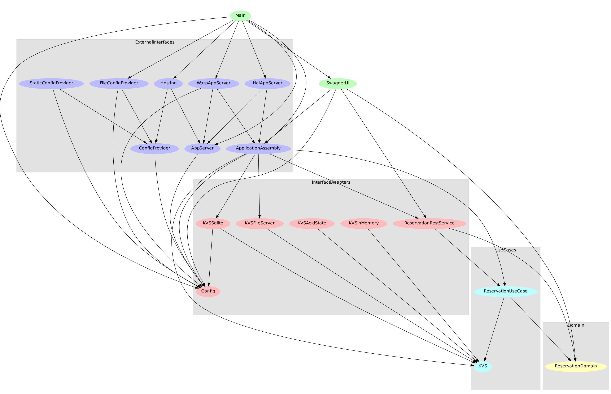

[](https://github.com/thma/PolysemyCleanArchitecture/actions)
<a href="https://github.com/thma/PolysemyCleanArchitecture"></a>


## Introduction

Welcome to yet another sequel of [Clean Architecture with Haskell and Polysemy](https://thma.github.io/posts/2020-05-29-polysemy-clean-architecture.html).

In my last to posts ([integration of Warp and Hal](https://thma.github.io/posts/2022-07-04-polysemy-and-warp.html) and [configuration of a polysemy app](https://thma.github.io/posts/2022-07-17-configuration-of-a-polysemy-app.html)) I was adding new features to my code base without caring much about one of the core rules of CleanArchitecture:

> The overriding rule that makes this architecture work is **The Dependency Rule**. 
> This rule says that source code dependencies can only point inwards.
> Nothing in an inner circle can know anything at all about something in an outer circle. 
> In particular, the name of something declared in an outer circle must not be mentioned by the code in the an inner circle. 
> That includes, functions, classes. variables, or any other named software entity.
>
> [Uncle Bob](https://blog.cleancoder.com/uncle-bob/2012/08/13/the-clean-architecture.html)

At one point for example I noticed that a module in the `InterfaceAdapters` package referenced code in the `ExternalInterfaces` package further out.

This mishap was easy to fix by moving the module to the `ExternalInterfaces` package , but I thought about ways to visualize module dependencies and to automatically verify that all dependencies comply to the **dependency rule**.

In this post I'll share my findings.

## Visualizing Module dependencies with graphmod

Whenever I think I had a brilliant idea, the Internet keeps telling me that someone else already had the same idea years ago...

So before starting to write my own *Module Dependency Visualizer* tool, I asked the Internet if others already had the same idea. 
And &ndash; not so surprisingly &ndash; I found [graphmod](https://github.com/yav/graphmod) by Iavor S. Diatchki. It analyses cabal or stack based projects and outputs [GraphViz](https://graphviz.org/) DOT models.

After installing it with

```bash
cabal install graphmod
```

The following command generates a detailed view on the dependencies in the PolySemyCleanArchitecture project:

```bash
graphmod | dot -Tpdf > dependencies.pdf
```

Here is the output:



As required by the CleanArchitecture model all dependencies are directed inwards. No dependencies are going from inner layers to more outward layers.

Graphmod also provides additional flags to reduce clutter by pruning, to visualize the dependencies without package clustering, etc.  
You'll find a few examples in [the graphmod wiki](https://github.com/yav/graphmod/wiki).

## Automating CleanArchitecture dependency validation

Visually inspecting a code base in this way is great. But it still involves manual effort if we intend to re-evaluate this image after each code change.

Wouldn't it be much more adequate to provide a fully automated dependency check to be include in each CI/CD run?

So in this section we are going to build such a tool.

### How to define CleanArchitecture compliance?

According to the dependency rule only references from outer to inner layers are permitted.

Given the four packages of our PolysemyCleanArchitecture project:

```haskell
-- | the list of source packages in descending order from outermost to innermost package in our CleanArchitecture project
cleanArchitecturePackages :: [Package]
cleanArchitecturePackages = ["ExternalInterfaces", "InterfaceAdapters", "UseCases", "Domain"]

-- | this type represents the package structure of a module e.g. Data.Time.Calendar resides in package Date.Time
type Package = String
```

all permitted dependency pairs `(fromModule, toModule)` can be computed with:

```haskell
-- | for a given list of packages this function produces the set of all allowed dependency pairs between packages.
--   Allowed dependencies according to CleanArchitecture:
--   1. imports within the same package
--   2. imports from outer layers to inner layers
cleanArchitectureCompliantDeps :: [Package] -> [(Package, Package)]
cleanArchitectureCompliantDeps [] = []
cleanArchitectureCompliantDeps lst@(p : ps) = zip (repeat p) lst ++ cleanArchitectureCompliantDeps ps
```

`cleanArchitectureCompliantDeps cleanArchitecturePackages` thus yields:

```haskell
[("ExternalInterfaces","ExternalInterfaces"),
 ("ExternalInterfaces","InterfaceAdapters"),
 ("ExternalInterfaces","UseCases"),
 ("ExternalInterfaces","Domain"),
 ("InterfaceAdapters","InterfaceAdapters"),
 ("InterfaceAdapters","UseCases"),
 ("InterfaceAdapters","Domain"),
 ("UseCases","UseCases"),
 ("UseCases","Domain"),
 ("Domain","Domain")]
```

The overall idea of the dependency check is to verify for all Haskell modules in our "src" folder that all their import statements are either contained in this list or are imports of some external libraries.

### Getting a list of all import declarations of all .hs files

In this step I will reuse functions and types from Graphmod. Graphmod comes with a `Utils` module that provides a function `parseFile :: FilePath -> IO (ModName,[Import])` which parses a file into a representation of its import declaration section. `ModName` and `Import` are defined as follows:

```haskell
data Import    = Import { impMod :: ModName, impType :: ImpType } deriving Show

data ImpType   = NormalImp | SourceImp deriving (Show,Eq,Ord)
 
data Qualifier = Hierarchy [String] | FromFile [String] deriving (Show)

type ModName   = (Qualifier,String)
```

Given this handy `parseFile` function we can collect all module import declaration under some folder `dir` with the following code:

```haskell
-- | this type represents the section of import declaration at the beginning of a Haskell module
type ModuleImportDeclarations = (ModName, [Import])

-- | scan all files under filepath 'dir' and return a list of all their import declarations.
allImportDeclarations :: FilePath -> IO [ModuleImportDeclarations]
allImportDeclarations dir = do
  files <- allFiles dir
  mapM parseFile files

-- | list all files in the given directory and recursively include all sub directories
allFiles :: FilePath -> IO [FilePath]
allFiles dir = do
  files <- listDirectory dir
  let qualifiedFiles = map (\f -> dir ++ "/" ++ f) files
  concatMapM
    ( \f -> do
        isFile <- doesDirectoryExist f
        if isFile
          then allFiles f
          else return [f]
    )
    qualifiedFiles
```

#### Always fix things upstream

As of version 1.4.4 Graphmod can not be included as a library dependency via Cabal or Stack. This will be fixed in 1.4.5. I have provided a [pull request](https://github.com/yav/graphmod/pull/40) that will allow to use the `Utils` module when including Graphmod in your package.yaml or cabal file.

### Validating the module import declarations

Now that we have all `ModuleImportDeclarations` collected in a list we must validate each of them.
We start with a function that validates the import declaration section of a single module as represented by a `ModuleImportDeclarations` instance. In order to validate this section we have to provide two more items:

1. a list `allPackages` containing all packages under consideration (in our case the `cleanArchitecturePackages` as defined above)

2. a list of all compliant dependency pairings between elements of the `allPackages` list, in our case the `cleanArchitectureCompliantDeps cleanArchitecturePackages` as defined above

```haskell
-- | this function verifies a ModuleImportDeclarations instance
--   (that is all import declarations of a given Haskell module.)
--   If all imports comply to the rules Right () is returned.
--   If offending imports are found, they are returned via Left.
verifyImportDecl :: [Package] -> [(Package, Package)] -> ModuleImportDeclarations -> Either ModuleImportDeclarations ()
verifyImportDecl allPackages compliantDependencies (packageFrom, imports) =
  let offending = filter (not . verify packageFrom) imports
   in if null offending
        then Right ()
        else Left (packageFrom, offending)
  where
    -- | verify checks a single import declaration.
    --   An import is compliant iff:
    --   1. it refers to some external package which not member of the 'packages' list or
    --   2. the package dependency is a member of the compliant dependencies between elements of the 'packages' list.
    verify :: ModName -> Import -> Bool
    verify pFrom imp =
      importPackage imp `notElem` allPackages
        || (modulePackage pFrom, importPackage imp) `elem` compliantDependencies


-- | this function returns the Package information from an Import definition
importPackage :: Import -> Package
importPackage imp = modulePackage (impMod imp)

-- | this function returns the Package information from a ModName definition
modulePackage :: ModName -> Package
modulePackage (q, _m) = intercalate "." (qualifierNodes q)
```

As a next step we define a function that maps the function `verifyImportDecl` over the complete list of all `ModuleImportDeclarations`. This results in a List of Eithers. I'm using `partitionEither` to transform the result into an
`Either [(ModName, [Import])] ()`:

```haskell
-- | verify the dependencies of a list of module import declarations. The results are collected into an 'Either [(ModName, [Import])] ()' which will be easier to handle in subsequent steps.
verifyAllDependencies :: [Package] -> [(Package, Package)] -> [ModuleImportDeclarations] -> Either [(ModName, [Import])] ()
verifyAllDependencies allPackages compliantDependencies imports= do
  let results = map (verifyImportDecl allPackages compliantDependencies) imports
  let (errs, _compliant) = partitionEithers results
  if null errs
    then Right ()
    else Left errs
```

We can use the generic `verifyAllDependencies` to create a specific `verifyCleanArchitectureDependencies` function which uses `cleanArchitecturePackages` and `cleanArchitectureCompliantDeps` to define the dependency rules for our CleanArchitecture project:

```haskell
-- | verify a list of ModuleImportDeclarations to comply to the clean architecture dependency rules.
verifyCleanArchitectureDependencies :: [ModuleImportDeclarations] -> Either [(ModName, [Import])] ()
verifyCleanArchitectureDependencies =
  verifyAllDependencies
    cleanArchitecturePackages
    (cleanArchitectureCompliantDeps cleanArchitecturePackages)
```

## Using the dependency checker in test cases

Using the dependency checker in test cases is quite straighforward.
First load all import declaractions than validate them:

```haskell
import Test.Hspec ( hspec, describe, it, shouldBe, Spec )
import DependencyChecker
    ( ModName,
      ImpType(..),
      Import(..),
      fromHierarchy,
      verifyCleanArchitectureDependencies,
      allImportDeclarations )

main :: IO ()
main = hspec spec

spec :: Spec
spec =
  describe "The Dependency Checker" $ do
    it "ensures that all modules comply to the outside-in rule" $ do
      allImports <- allImportDeclarations "src"
      formatLeftAsErrMsg 
        (verifyCleanArchitectureDependencies allImports) `shouldBe` Right ()
```

As you can see from executing the tests with `stack test`, the dependency checker does not find any issues in the codebase:

```bash
CleanArchitecture
  The Dependency Checker
    ensures that all modules comply to the outside-in rule
```

But if we add an offending dependency to some of the modules, say adding

```haskell
import InterfaceAdapters.Config
```

to `Domain.ReservationDomain` and to `UseCases.ReservationUseCase`, we'll get a failure with the following message:

```
Failures:

  test/CleanArchitectureSpec.hs:22:75: 
  1) CleanArchitecture, The Dependency Checker, makes sure all modules comply to the outside-in rule
       expected: Right ()
        but got: Left [
          "Domain.ReservationDomain imports InterfaceAdapters.Config",
          "UseCases.ReservationUseCase imports InterfaceAdapters.Config"]

```

the rendering of the Error message is done by the helper function `formatLeftAsErrMsg`:

```haskell
-- | Right () is returned unchanged, 
--   Left imports will be rendered as a human readable error message.
formatLeftAsErrMsg :: Either [ModuleImportDeclarations] () -> Either [String] ()
formatLeftAsErrMsg (Right ()) = Right ()
formatLeftAsErrMsg (Left imports) = Left (map toString imports)
  where
    toString :: ModuleImportDeclarations -> String
    toString (modName, imports) = ppModule modName ++ " imports [" ++ intercalate ", " (map (ppModule . impMod) imports) ++ "]"

```

## Conclusion

Thanks to Graphmod rolling our own depency checker worked like a charm.

Adding such an automated dependency validation to our testsuite will help to maintain our architecture clean even if we don't pay attention while coding.
