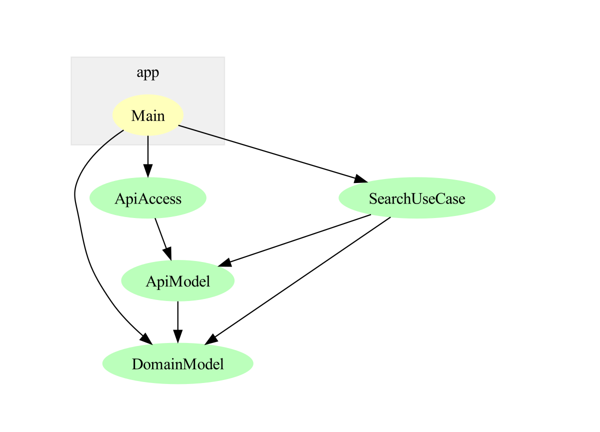

<a href="https://github.com/thma/clean-architecture-with-functions/"></a>


## Interesting design challenges in seemingly simple programs

The other day I wrote a simple Haskell program that retrieves data from a REST API and processes it.
The task at hand sounded simple enough to just start coding without too much upfront thinking.

This blog post is about how I discovered the shortcomings of my original design and how I improved it with some simple refactorings. 
Since everything interesting happens in the API access, I will focus on this part of the code.

In order to allow you to experiment with the code yourself, I'm not using the proprietary API of my original project but rather a publicly available REST API ([OpenLibrary](https://openlibrary.org/developers/api)).

## The original design

So without further ado, let's start with the domain data types:

````haskell
data Book = Book
  { bkTitle   :: String,
    bkAuthors :: [String],
    bkYear    :: Maybe Int
  }
  deriving (Eq, Show)

instance FromJSON Book where
  parseJSON (Object b) =
    Book
      <$> b .: "title"
      <*> b .:? "author_name" .!= []
      <*> b .:? "first_publish_year"
  parseJSON _ = mempty
````

The `Book` type is a simple record type with a few fields. The `FromJSON` instance is used to parse the JSON data returned by the REST API.

Next, we need a function to retrieve the data from the REST API. The API allows us to retrieve the data in pages. Each page contains a list of books and the total number of books found. The following function retrieves a single page. The parameters are the query string, the page size and the page number:

````haskell
getBookPage :: String -> Int -> Int -> IO BookResp
getBookPage queryString pageSize pageId = do
  request <- parseRequest $ 
    searchUrl ++ queryString ++ 
      "&page=" ++ show pageId ++ 
      "&limit=" ++ show pageSize
  response <- httpJSON request
  return $ getResponseBody response

data BookResp = BookResp
  { brDocs  :: [Book],
    brFound :: Int
  }
  deriving (Eq, Show)

instance FromJSON BookResp where
  parseJSON (Object br) =
    BookResp
      <$> br .: "docs"
      <*> br .: "numFound"
  parseJSON _ = mempty

searchUrl :: String
searchUrl = "http://openlibrary.org/search.json?q="
````

Based on this function which retrieves a single page, we can write a function which retrieves all pages:

````haskell 
searchBooks :: Int -> Int -> String -> IO [Book]
searchBooks pageSize limitPages queryString = do
  firstPage <- getBookPage queryString pageSize 1 -- index starts at 1 !
  let numOfBooks = brFound firstPage
      numPages = min (numOfBooks `div` pageSize + 1) limitPages
      otherPages = 
        if numPages == 1 
          then [] 
          else map (getBookPage queryString pageSize) [1 .. numPages]
  allPages <- (firstPage :) <$> sequence otherPages
  return $ concatMap brDocs allPages
````  

The `searchBooks` function takes a page size, a limit for the number of pages and a query string. 
It then retrieves all pages and concatenates the books from all pages into a single list.

Now we have all the pieces in place to write the main function:

````haskell
main :: IO ()
main = do
  -- search for books with "Haskell Curry" in title or author fields, 
  -- limit to 10 pages of 50 books each (== 500 books)
  books <- searchBooks 50 10 "Haskell Language"
  putStrLn $ "Number of matching books: " ++ show (length books)
  mapM_ (putStrLn . bkTitle) books
````

This will print the number of books found and their respective titles. 
````
Number of matching books: 34
````

A quick manual check on the Open Library website confirms that the number of books found is indeed correct.

That was is easy, wasn't it? But wait, let's have a closer look by changing the page size...

## It's just an off-by-one error...

````haskell
main :: IO ()
main = do
  -- search for books with "Haskell Curry" in title or author fields, 
  -- limit to 10 pages of 10 books each (== 100 books)
  books <- searchBooks 10 10 "Haskell Language"
  putStrLn $ "Number of matching books: " ++ show (length books)
  mapM_ (putStrLn . bkTitle) books
````

Now we get the following output:
````
Number of matching books: 44
````

What happened here? Instead of the correct number of 34 books we now get 44 books returned.
It seems that this was caused by the changing the page size. As we get exactly 10 books more as expected it seems that we get one page more than we asked for.

So let's have a closer look at the `searchBooks` function.
It starts by retrieving the first page which also contains the total number of found books.
This value is bound to the `numOfBooks` variable.
Next the total number of pages is calculated by dividing the number of books by the page size and adding 1.
By binding the minimum of this value and the limit for the number of pages to the `numPages` variable, we ensure that we don't retrieve more pages than we asked for.
Finally, the `otherPages` variable is bound to a list of all pages except the first page.

And here we have our off-by-one error. The list comprehension should start at 2 instead of 1:

````haskell 
searchBooks :: Int -> Int -> String -> IO [Book]
searchBooks pageSize limitPages queryString = do
  firstPage <- getBookPage queryString pageSize 1 -- index starts at 1 !
  let numOfBooks = brFound firstPage
      numPages = min (numOfBooks `div` pageSize + 1) limitPages
      otherPages = 
        if numPages == 1 
          then [] 
          else map (getBookPage queryString pageSize) [2 .. numPages]
  allPages <- (firstPage :) <$> sequence otherPages
  return $ concatMap brDocs allPages
````  

This finding seems to be a perfect fit for the following quote:

> There are only two hard problems in computer science: 
>
> 0. cache invalidation 
> 1. naming things. 
> 2. off-by-one errors

## Do as I say, not as I do.

At this point I felt a bit uncomfortable as I realized that I should have written some unit tests to catch this error. Or even better to start with the tests and then write the code.

If you have read some of my other blog posts, you might have noticed that I'm a big fan of unit testing and property based testing in particular. 
So why didn't I write any tests for this code? 

The answer is simple: `searchBooks` is directly coupled to the page access function `getBookPage`.
All unit tests for `searchBooks` would interact directly with the real openlibrary API. This would render the tests unstable as the API could be offline or give different results over time.

So what can we do about this? We need to decouple the `searchBooks` function from the `getBookPage` function. Functional programming offers us a simple solution for this problem: *higher order functions*. In this case: allowing to pass the page access function as a parameter to `searchBooks`.

## From cruft to craft

In this section we will refactor the code to allow passing the page access function as a parameter to `searchBooks`.
Let's start by defining a type for the page access function. I have also changed the `Int` parameters to `Natural` as I don't want to allow negative page sizes and offsets.

````haskell
type PageAccess = String -> Natural -> Natural -> IO BookResp
````

Next we will change the signature of `getBookPage` to match this type:

````haskell
getBookPage :: PageAccess
getBookPage queryString pageSize pageId = do
  request <-
    parseRequest $
      searchUrl
        ++ queryString
        ++ "&page="  ++ show pageId
        ++ "&limit=" ++ show pageSize
  response <- httpJSON request
  return $ getResponseBody response
````

Finally we will rewrite `searchBooks` to have an additional parameter of type `PageAccess`:

````haskell
searchBooks :: PageAccess -> Natural -> Natural -> String -> IO [Book]
searchBooks bookPageFun pageSize limitPages queryString = do
  firstPage <- bookPageFun queryString pageSize 1
  let numOfBooks = brFound firstPage
      numPages = min (numOfBooks `div` pageSize + 1) limitPages
      otherPages =
        if numPages == 1
          then []
          else map (bookPageFun queryString pageSize) [2 .. numPages]
  allPages <- (firstPage :) <$> sequence otherPages
  return $ concatMap brDocs allPages
````

This simple change allows us to use `searchBooks` with different page access functions.
The main function now looks like this:

````haskell
main :: IO ()
main = do
  -- search for books with "Haskell Curry" in title or author fields, 
  -- limit to 10 pages of 10 books each (== 100 books)
  let openLibrarySearch = searchBooks getBookPage 10 10
  books <- openLibrarySearch "Haskell Curry" 
  putStrLn $ "Number of matching books: " ++ show (length books)
  mapM_ (putStrLn . bkTitle) books
````

## Finally, some unit tests

We can now use this decoupling to pass a mock page access function to `searchBooks` in order to write unit tests for it.
Let's start by writing a mock page access which returns a specified number of books:

````haskell
-- | A mock implementation of the book page access function.
--   The argument resultCount specifies the total number of books to return.
mockBookPageImpl :: Natural -> PageAccess
mockBookPageImpl _ _ _ 0 = error "pageId must be >= 1"
mockBookPageImpl resultCount _queryString pageSize pageId =
  let (numFullPages, remainder) = resultCount `quotRem` pageSize
      numPages = if remainder == 0 then numFullPages else numFullPages + 1
  in  if pageId <= numFullPages
        then return $ BookResp (replicate (fromIntegral pageSize) sampleBook) resultCount
        else if remainder /= 0 && pageId == numPages
          then return $ BookResp (replicate (fromIntegral remainder) sampleBook) resultCount
          else return $ BookResp [] resultCount

sampleBook :: Book
sampleBook = Book
  { bkTitle = "The Lord of the Rings",
    bkAuthors = ["J. R. R. Tolkien"],
    bkYear = Just 1954
  }
````

Now we can start to write unit tests for `searchBooks`:

````haskell
spec :: Spec
spec = do
  describe "Using a paging backend API as data input" $ do
    it "works for empty result" $ do
      let mockSearch = searchBooks (mockBookPageImpl 0) 50 10
      result <- mockSearch "Harry Potter"
      length result `shouldBe` 0
    it "respects the max number of pages parameter" $ do
      let mockSearch = searchBooks (mockBookPageImpl 100) 5 10
      result <- mockSearch "Harry Potter"
      length result `shouldBe` 50
    it "works correctly in the last page" $ do
      let mockSearch = searchBooks (mockBookPageImpl 49) 5 10
      result <- mockSearch "Harry Potter"
      length result `shouldBe` 49
    it "can deal with arbitrary result sizes" $
      property $ \resultSize -> do
        let mockSearch = searchBooks (mockBookPageImpl resultSize) 5 10
        result <- mockSearch "Harry Potter"
        length result `shouldBe` fromIntegral (min resultSize 50)
    it "can deal with arbitrary page sizes" $
      property $ \ps -> do
        let pageSize = ps + 1
            mockSearch = searchBooks (mockBookPageImpl 100) pageSize 10
        result <- mockSearch "Harry Potter"
        length result `shouldBe` fromIntegral (min 100 (pageSize * 10))
````

which results in the following output:

````sh
SearchBooks
  Using a paging backend API as data input
    works for empty result [✔]
    respects the max number of pages parameter [✔]
    works correctly in the last page [✔]
    can deal with arbitrary result sizes [✔]
      +++ OK, passed 100 tests.
    can deal with arbitrary page sizes [✔]
      +++ OK, passed 100 tests.
````

So now we have a unit test suite for `searchBooks` which doesn't depend on the real API. This was made possible by decoupling the page access function from `searchBooks`. 

## Decoupling and Clean Architecture

In order to illustrate the decoupling achieved by this refactoring, I have created a dependency graph of the modules involved. The arrows indicate the direction of the dependencies. The `searchBooks` function (in the `SearchUseCase` module) does only depend on the `PageAccess` type (in the `ApiModel` module) and of course on the `Book` type in the `DomainModel` module. 

The `Main` module takes the `getBookPage` function (from module `ApiAccess`) and passes it to the `searchBooks` function in order to work against the real API.
`getBookPage` only depends on the `PageAccess` type.



(Generated with [GraphMod](https://hackage.haskell.org/package/graphmod))

This is exactly the kind of decoupling that the [clean architecture](https://thma.github.io/posts/2020-05-29-polysemy-clean-architecture.html) advocates:

> The overriding rule that makes this architecture work is The Dependency Rule. 
> This rule says that source code dependencies can only point inwards. 
> Nothing in an inner circle can know anything at all about something in an outer circle. 
> In particular, the name of something declared in an outer circle must not be mentioned by the code in the an inner circle. 
> That includes, functions, classes. variables, or any other named software entity.
> 
> Quoted from [Clean Architecture blog post](https://blog.cleancoder.com/uncle-bob/2012/08/13/the-clean-architecture.html)


I hope that this post has shown you that the clean architecture is not only applicable to large projects. Even in very small projects it can help to decouple business logic from infrastructure code and thus greatly improve testability.

Luckily for us Haskell programmers, we don't need to use any frameworks to achieve this decoupling. We can use higher order functions to achieve the same result.
